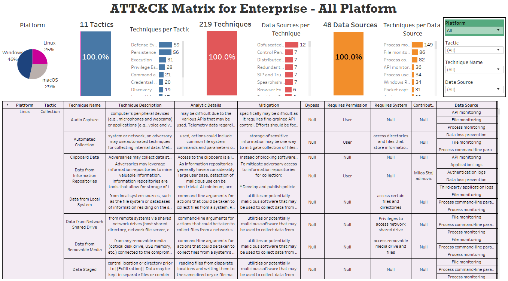
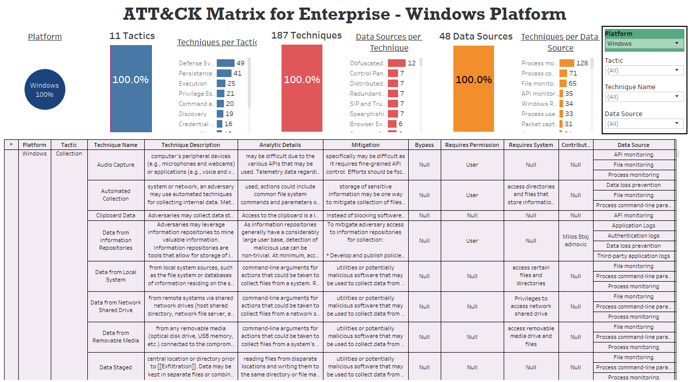
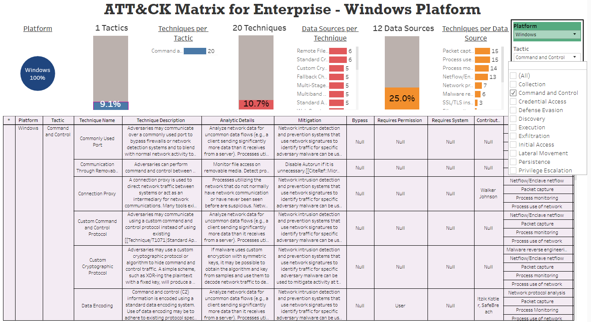
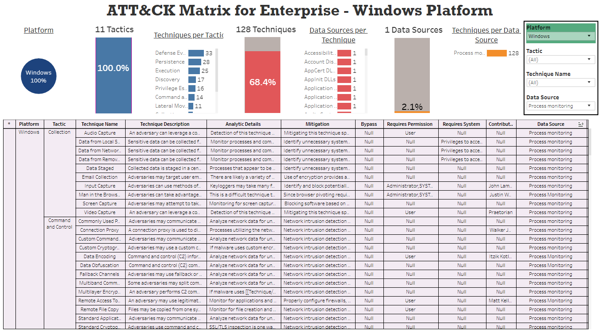
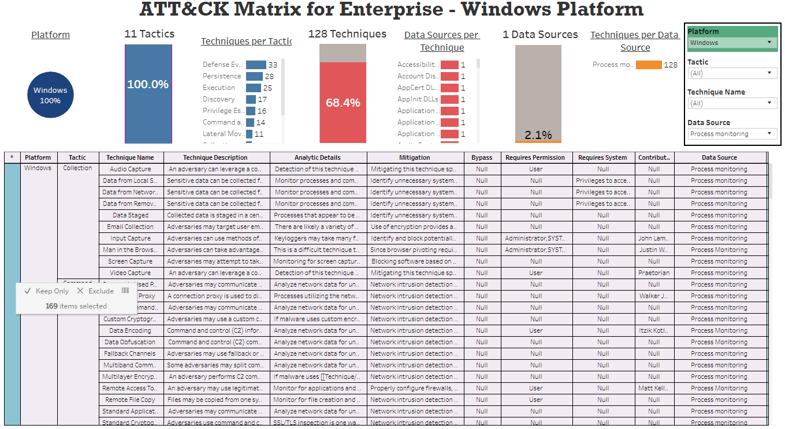
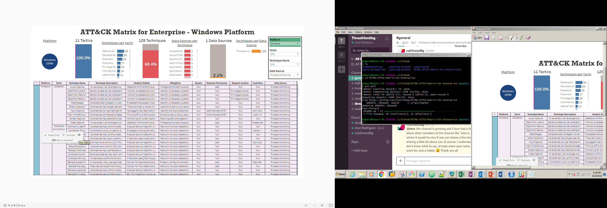
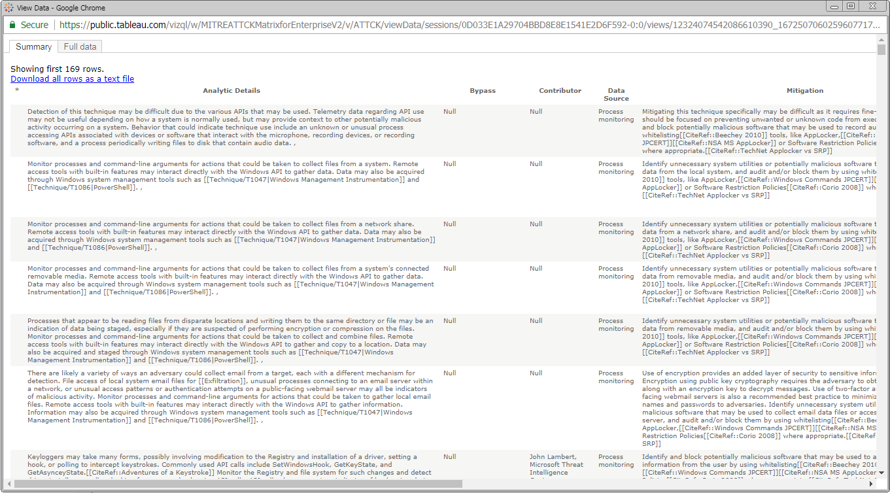
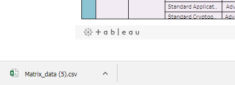
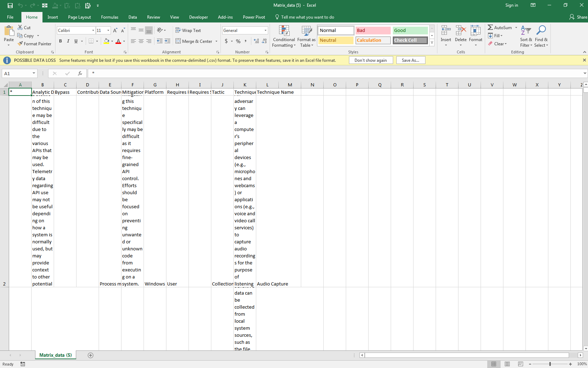
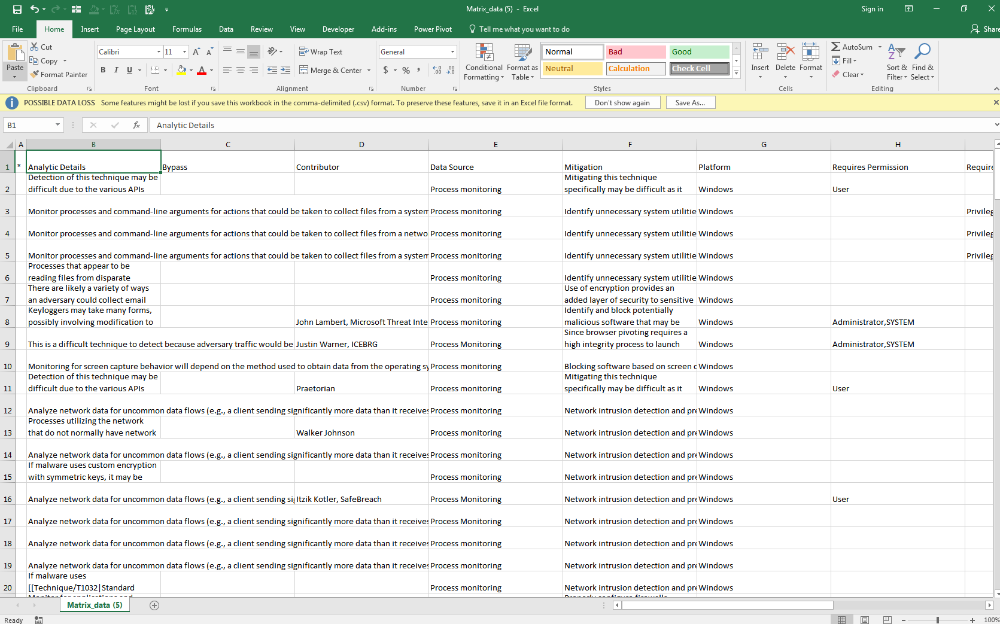

# Tableau ATT&CK Dashboard

## Goals
- Quantify the relationship between **Platforms, Tactics, Techniques, and Data Sources**
- Summarize data and information about **ATT&CK Matrix for Enterprise**
- Develop a dashboard with **Tableau** to present the results of this analysis

## Tableau Public Dashboard
- [Tableau Dashboard - ATT&CK Matrix for Enterprise](https://public.tableau.com/profile/cyb3rpanda#!/vizhome/MITREATTCKMatrixforEnterpriseV2/ATTCK?publish=yes)

## Resources
- [MITRE-ATT&CK](https://attack.mitre.org/wiki/Main_Page)
- [Tableau Public](https://public.tableau.com/en-us/s/)
- [Spread Sheet - ATTCK Matrix for Enterprise](https://docs.google.com/spreadsheets/d/1voZ_CdlYQHw2jgp-Ses-hW7cH5vZhSoVevBL7PvIXPQ/edit#gid=0)

## Understanding the Dashboard
The minimum unit of analysis for this matrix is the combinations between Platform, Tactics, Techniques, and Data Sources. Considering this, the matrix table has 1715 records.

* **Pie Chart (Platform):** This graphic shows us the distribution of the records by Platform. If we consider all the records: 46% belongs to Windows, 29% belongs to macOS, and 25% belongs to Linux.

* **Blue Bar Charts (Tactics):** This graphic shows us the following information: Number of Tactics (On Top of the vertical bar chart), Relative Percentage with respect to the Total of Tactics of the selected Platform (Vertical bar chart), and the number of Techniques for each Tactic (Horizontal bar chart).

* **Red Bar Charts (Techniques):** This graphic shows us the following information: Number of Techniques (On Top of the vertical bar chart), Relative Percentage with respect to the Total of Techniques of the selected Platform (Vertical bar chart), and the number of Data Sources for each Technique (Horizontal bar chart).

* **Orange Bar Charts (Data Sources):** This graphic shows us the following information: Number of Data Sources (On Top of the vertical bar chart), Relative Percentage with respect to the Total of Data Sources of the selected Platform (Vertical bar chart), and the number of Techniques for each Data Source (Horizontal bar chart).

* **Text table (Summary of Data):** This table shows us a summary of data about the ATT&amp;CK Matrix for Enterprise. This table allows us to export data into a CSV file.

* **Filters (Green Box):** You can perform filters using the fields related to the minimum unit of analysis: Platform, Tactics, Techniques, and Data Sources. The most general filter is Platform and the most specific is Data Source. The values of the 4 fields are filtered among themselves.

This is a general view of the dashboard: Without any filter selected, there are 11 Tactics, 219 Techniques, and 48 Data Sources for all the Platforms.

## Using The Tableau Dashboard
**1. Filtering the data:** Select a variable or variables for analysis (Green box): You have four options to filter data and perform an analysis (Platforms, Tactics, Techniques, and Data Sources).

First example of view: Platform & Tactic 
  * **Platform filter = Windows:**
  * When we filter the matrix by the Windows platform, the pie chart shows us a value of 100%.
  * For this platform, there are 11 tactics, 187 techniques, and 48 data sources. These values will represent 100% for each field.
   

    
  * **Tactic filter = Command and Control:**
  * Considering the Windows platform, now we can filter the matrix by the tactic "Command and Control".
  * With this second filter, we have the following results:
   * **1 tactic** *(9.1% = 1/11)*
   * **20 techniques** *(10.7% = 20/187)*
   * **12 data sources** *(25.0% = 12/48)*
  * From a techniques perspective, **"Remote File Copy" and "Standard Cryptographic Protocol"** are the techniques with the highest number of **data sources (6 from 12 available)**.
  * From a data sources perspective, **"Packet Capture" and "Process Use of network"** are the most relevant data sources for this tactic because they are related to **15 techniqes out of 20 available**.

    
Second example of view: Platform & Data Source
  * **Platform filter = Windows:**
  * When we filter the matrix by the Windows platform, the pie chart shows us a value of 100%.
  * For this platform, there are 11 tactics, 187 techniques, and 48 data sources. These values will represent 100% for each field.
  * If we check the orange horizontal bar chart, we can determine that **"Process Monitorin"** is the data source most relevant to this platform because is related to **128 techniques out of 187 available**.

    
  * **Data Source Filter = Process Monitoring:**
  * Considering the Windows platform, now we can filter the matrix by the data source "Process Monitoring".
  * With this second filter, we have the following result:
   * **Process Monitoring** is relevant for 128 techniques that represent 68.4% (128/187), and it's also relevant for all the tactics (100%).

**2. Exporting the Text Table to a .CSV file:**

* First you need to click the first column of the table (Asterix) and maintain the cursor over the column until a little gray box appears.

* Then you need to click "View Data Buttom" (On the right).

* After that this window will appear. You need to click on "Download all rows as a text file".

* A .CSV file will appear at the bottom of you screen.

* When you open de .CSV file, because of some cells have a lot of characters, the file will look like this:

* If you adjust the rows height, the .CSV file will look like this:

## Author
- Jose Luis Rodriguez [Cyb3rPanda](https://twitter.com/Cyb3rPandaH)
- Roberto Rodriguez [Cyb3rWarD0g](https://twitter.com/Cyb3rWard0g)
## Contributors
## Contributing
## TO-DO
- [ ] Include APT Tool Analysis in a new dashboard.
